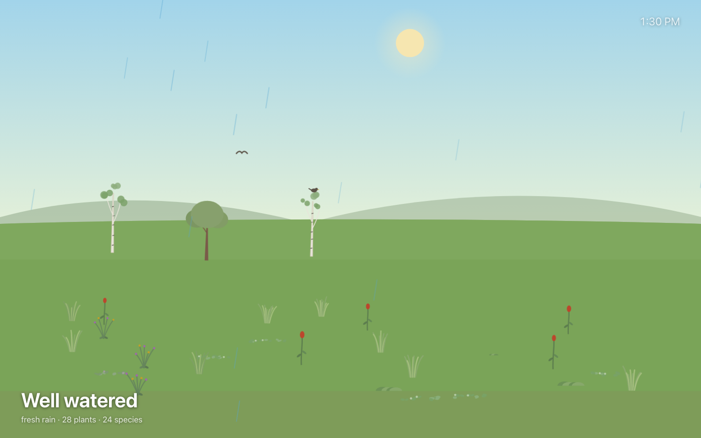
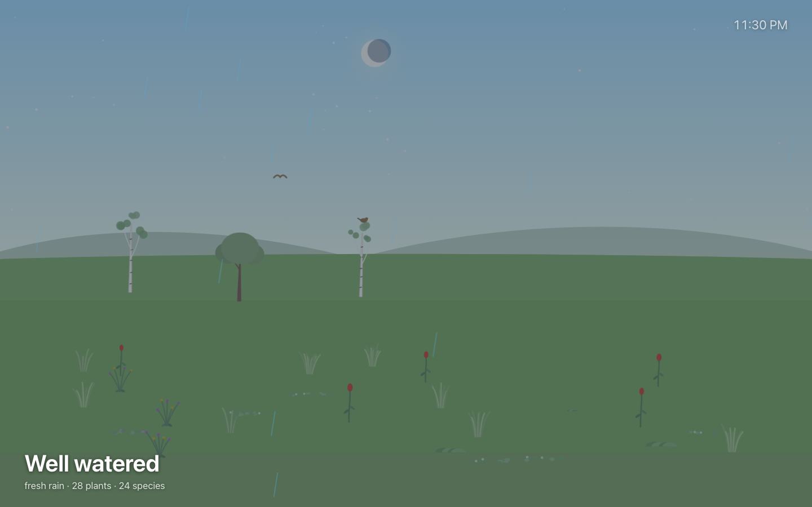
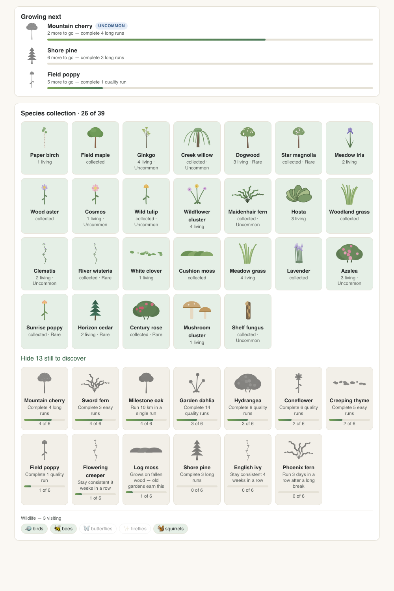
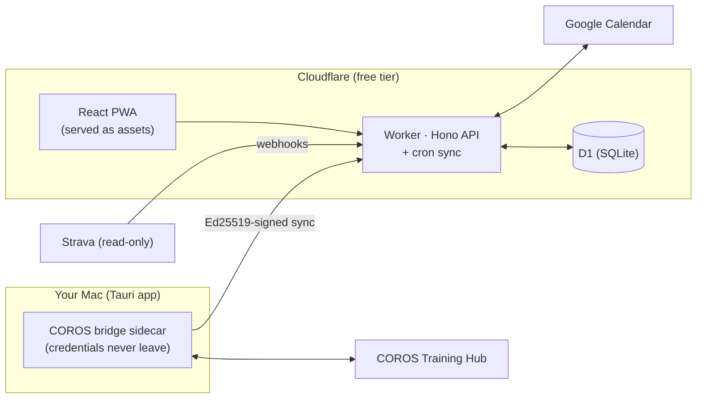

# Run Garden 🌱

[](https://github.com/kyranstar/run-garden/actions/workflows/ci.yml)
[](https://github.com/kyranstar/run-garden/actions/workflows/deploy.yml)
[](https://github.com/kyranstar/run-garden/actions/workflows/release.yml)

A private, single-user running companion that closes one loop:

**COROS training plan → realistic calendar → correctly scheduled watch workout → completed run → visible progress → a living garden.**

Every run you complete brings rain. Consistency grows trees, unlocks species, and draws
wildlife. Skip a week and the clouds gather; come back and recovery rain falls. The same
running history always grows the exact same garden — it is a deterministic, event-sourced
simulation of your training life, not a widget.



*The same garden, same day, 11:30 PM — the sun and moon track your real clock:*



## What it does

- **Mirrors your COROS plan into Google Calendar** with honest duration estimates and
  buffers, so training fits the week you actually have.
- **Moves workouts with one decision** — and writes the move back to COROS when that is
  safe and verified (see the honest write status below).
- **Matches completed runs** from COROS and Strava back to the plan, merging both copies
  of the same physical run into one record and self-healing past sync bugs on every sync.
- **Grows the garden** from your consistency: planned runs bring rain and plant species;
  quality runs bring flowers, long runs bring trees; two weeks of silence brings drought.
- **Species codex & achievements** — every species in the game is collectible, with the
  locked ones showing exactly what earns them ("Run 10 km in a single run", "Start 5 runs
  before 7 am") and live progress bars that share one implementation with the award logic,
  so a nudge can never lie:



- **Interpretable insights, honestly suppressed** — training-load ratio, easy/hard
  balance, HR drift, easy-run discipline and more, each with a healthy range, a gentle
  suggestion, and a drilldown to the exact runs (and laps) behind the number. Metrics
  without enough data say so instead of guessing.
- **Ambient mode** — the macOS app can fill the screen with your live garden like a
  screensaver, automatically after idle, with the sun and moon tracking your clock.

## Architecture



The bridge on your Mac is the only thing that talks to COROS; it pushes plan snapshots
and completed runs up over an Ed25519-signed channel and pulls approved schedule moves
down. The worker owns matching, calendar reconciliation, analytics, and the garden
simulation. The web app (and the ambient window) just render what the worker computes.

| Path | Package | What it is |
|---|---|---|
| `apps/worker` | `@rg/worker` | Cloudflare Worker: Hono API, cron sync, D1, serves the built web app |
| `apps/web` | `@rg/web` | React PWA (Vite) — the phone/desktop browser UI |
| `apps/desktop` | `@rg/desktop` | Tauri 2 macOS app hosting the COROS bridge sidecar + encrypted cred store |
| `services/coros-bridge` | `@rg/coros-bridge` | TypeScript sidecar speaking the (unofficial) COROS Training Hub API, NDJSON over stdio |
| `packages/domain` | `@rg/domain` | Shared types, state machines, time math, preferences |
| `packages/database` | `@rg/database` | Drizzle schema + D1 migrations |
| `packages/providers` | `@rg/providers` | COROS/Strava normalizers, dedup merge, completion matching, fixtures |
| `packages/scheduling` | `@rg/scheduling` | Classification, duration estimation, calendar blocks, reschedule candidates |
| `packages/calendar` | `@rg/calendar` | Pure Google Calendar reconciliation (event bodies, manual-edit detection) |
| `packages/analytics` | `@rg/analytics` | Deterministic metrics with honest sample-size suppression |
| `packages/garden-engine` | `@rg/garden-engine` | Event-sourced, seeded-PRNG garden simulation |
| `packages/garden-renderer` | `@rg/garden-renderer` | Self-contained SVG garden scene renderer |
| `packages/ui` | `@rg/ui` | Shared React components |
| `packages/api-client` | `@rg/api-client` | Typed client for the worker API |

Three deployables: the **worker** (API + web assets), the **web PWA** (installable on
iPhone), and the **desktop app** (signed personal build with silent self-update, no App
Store). Push to `main` deploys the worker + web; a `v*` tag builds and publishes the
desktop app.

## The honest COROS write status

There is no official self-service COROS write API today. Run Garden's write paths, in
priority order (see [docs/COROS_INTEGRATION_FINDINGS.md](docs/COROS_INTEGRATION_FINDINGS.md)):

1. **Official COROS MCP write tools** — announced "coming soon" upstream; the worker
   probes `tools/list` so official writes take over automatically when they ship. The
   official MCP is **read-only today**.
2. **Unofficial Training Hub web API** via the **desktop bridge** on your Mac — the
   implemented write path (direct schedule update preserving all identity fields,
   verified by a read-after-write; see [docs/COROS_WRITE_PROTOCOL.md](docs/COROS_WRITE_PROTOCOL.md)).
3. **Remove-and-add fallback** (insert-before-delete, flagged as degraded).
4. **Calendar-only** — the automatic fallback state when no write path is available.

A reversible **live write spike** (`pnpm coros:spike`, or the desktop app's "Run schedule
write test") must pass against your real COROS account before you should trust schedule
writes. After a verified write the UI says *"COROS calendar updated · Open COROS to sync
your watch"* — never "Updated on watch", because no server-side watch push exists.

## Security & cost

- Single Google account allowlist; nobody else can sign in.
- The COROS password lives **only on your Mac**, in an AES-256-GCM file keyed to the
  machine's hardware UUID — never in the cloud, argv, env, or logs.
- The desktop pairs as a device with an Ed25519 keypair; every bridge request is signed.
- Strava is strictly **read-only**. Provider tokens are encrypted at rest.
- Runs on Cloudflare's free/near-free tiers with a **hard $10/week LLM ceiling** (AI is
  optional and off-switchable) — see [docs/COSTS.md](docs/COSTS.md) and
  [docs/SECURITY.md](docs/SECURITY.md).

## Local development (no real accounts needed)

```bash
pnpm install
cp apps/worker/.dev.vars.example apps/worker/.dev.vars   # FIXTURE_MODE=1 is preset
pnpm db:migrate:local                                    # create local D1 schema
pnpm dev                                                 # worker :8787 + web :5173
```

Open http://localhost:5173, then seed a deterministic world:

```bash
curl -X POST http://localhost:8787/api/dev/fixture-login -c cookies.txt
curl -X POST http://localhost:8787/api/dev/seed -b cookies.txt
```

Fixture mode is explicit, never silent: both endpoints 403 unless `FIXTURE_MODE=1`.

> **Node versions:** tests need Node 21 (better-sqlite3 native ABI); wrangler and the
> builds need Node 22. CI handles both; locally, `nvm use 21` for `pnpm test` and
> `nvm use 22` for everything else.

Other root scripts: `pnpm typecheck`, `pnpm test`, `pnpm build:web`, `pnpm dev:desktop`,
`pnpm coros:spike`, `pnpm db:generate`.

## Documentation

| Doc | Contents |
|---|---|
| [docs/ARCHITECTURE.md](docs/ARCHITECTURE.md) | Package graph, data-authority rules, the three date concepts, bridge↔cloud flow |
| [docs/DATA_MODEL.md](docs/DATA_MODEL.md) | Every table, grouped, with provenance fields |
| [docs/SYNC_AND_RECONCILIATION.md](docs/SYNC_AND_RECONCILIATION.md) | COROS reconciliation rules 1–11, sync states, calendar reconciliation, matching |
| [docs/DURATION_ESTIMATION.md](docs/DURATION_ESTIMATION.md) | Estimate priority chain + calendar block formula |
| [docs/GARDEN_ENGINE.md](docs/GARDEN_ENGINE.md) | Decay curve, species catalog, determinism, replay |
| [docs/ANALYTICS.md](docs/ANALYTICS.md) | Each metric's rule and suppression threshold |
| [docs/SECURITY.md](docs/SECURITY.md) | Credential handling, signing, encryption, deletion |
| [docs/DESKTOP_APP.md](docs/DESKTOP_APP.md) | Tauri app, sidecar, pairing, build commands |
| [docs/DEPLOYMENT.md](docs/DEPLOYMENT.md) | End-to-end deploy: Cloudflare, Google, Strava, PWA install |
| [docs/TESTING.md](docs/TESTING.md) | What's covered, how to run, what needs live credentials |
| [docs/COSTS.md](docs/COSTS.md) | Monthly cost model and scenarios |
| [docs/COROS_WRITE_PROTOCOL.md](docs/COROS_WRITE_PROTOCOL.md) | The exact safe-write protocol and state machine |
| [docs/COROS_INTEGRATION_FINDINGS.md](docs/COROS_INTEGRATION_FINDINGS.md) | Verified research the integration is built on |
