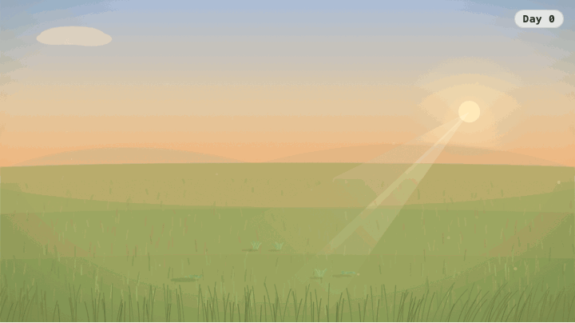

# Run Garden 🌱

[](https://github.com/kyranstar/run-garden/actions/workflows/ci.yml)
[](https://github.com/kyranstar/run-garden/actions/workflows/deploy.yml)
[](https://github.com/kyranstar/run-garden/actions/workflows/release.yml)

**Your training becomes a garden — skip a week and it shows, string weeks together and it grows.**



*Every frame is the real garden engine and the real renderer, not a mockup — rain after a run, a canopy after two months of showing up.*

## The problem

Your training plan lives on your watch. Your actual week lives in Google Calendar. Your history lives in whatever app or spreadsheet you gave up updating a few months ago. None of them talk to each other, so staying on top of your own training means reassembling the same picture by hand, over and over.

And even when you do, **consistency doesn't feel like anything.** A number like "84% adherence last month" doesn't register the way a missed run or a good week actually should. The feedback is too abstract and too delayed to change what you do next.

## The solution

**Run Garden turns training you're already doing — running via COROS, lifting, yoga — into a living garden.** Complete a planned run and it rains. String weeks together and trees mature and new species arrive. Skip too long and the clouds gather and the ground dries out; come back, and the first run back brings its own reward instead of a guilt trip.

- **Balance keeps the ecosystem healthy.** Running waters the garden, lifting builds its structure, yoga tends its variety — lean on only one discipline for too long and the garden is what tells you.
- **Your plan, Google Calendar, and your watch stay in sync — automatically.** One line tells you the truth: *"Calendar, COROS and watch in sync · 2m ago."* When something can't reconcile itself, you get an undo, never a wall of error states.
- **An AI plan studio writes lifting plans straight to your watch** — describe what you want, review the sessions, push. No hand-entry into COROS.
- **A garden timeline lets you scrub back through your whole history** — every day you've ever trained, replayed from the same deterministic simulation that grew the garden the first time.
- **A desktop companion bridges to COROS** — the only thing that ever talks to it — **and doubles as an ambient screensaver**, so the garden is still there when you're not looking for it.

## How it works

- **A Cloudflare Worker + D1** run the API, the cron sync, and all reconciliation — one deploy, free tier, gated to a single allow-listed Google account.
- **A desktop bridge on your Mac** is the only thing that ever talks to COROS; your credentials never leave the machine.
- **A deterministic, event-sourced garden engine** replays your training history through a seeded simulation — the same history always grows the same garden.
- **A self-contained SVG renderer** draws the garden straight from that simulation state, live — the GIF above and the app itself use the exact same code path.
- **A React PWA** installs on your phone; the desktop app is the same garden, ambient, on your Mac.

## Getting started

No real accounts needed — fixture mode seeds a deterministic world.

```bash
pnpm install
cp apps/worker/.dev.vars.example apps/worker/.dev.vars   # FIXTURE_MODE=1 is preset
pnpm db:migrate:local                                    # create local D1 schema
pnpm dev                                                 # worker :8787 + web :5173
```

Open http://localhost:5173, then seed the world:

```bash
curl -X POST http://localhost:8787/api/dev/fixture-login -c cookies.txt
curl -X POST http://localhost:8787/api/dev/seed -b cookies.txt
```

> **Node versions:** tests need Node 21 (better-sqlite3 native ABI); wrangler and the builds need Node 22. `nvm use 21` for `pnpm test`, `nvm use 22` for everything else.

Other root scripts: `pnpm typecheck`, `pnpm test`, `pnpm build:web`, `pnpm dev:desktop`, `pnpm coros:spike`, `pnpm db:generate`.

## More

| Doc | Contents |
|---|---|
| [docs/ARCHITECTURE.md](docs/ARCHITECTURE.md) | Package graph, data-authority rules, the three date concepts, bridge↔cloud flow |
| [docs/DATA_MODEL.md](docs/DATA_MODEL.md) | Every table, grouped, with provenance fields |
| [docs/SYNC_AND_RECONCILIATION.md](docs/SYNC_AND_RECONCILIATION.md) | COROS reconciliation rules 1–11, sync states, calendar reconciliation, matching |
| [docs/DURATION_ESTIMATION.md](docs/DURATION_ESTIMATION.md) | Estimate priority chain + calendar block formula |
| [docs/GARDEN_ENGINE.md](docs/GARDEN_ENGINE.md) | Decay curve, species catalog, determinism, replay |
| [docs/ANALYTICS.md](docs/ANALYTICS.md) | Each metric's rule and suppression threshold |
| [docs/SECURITY.md](docs/SECURITY.md) | Credential handling, signing, encryption, deletion |
| [docs/DESKTOP_APP.md](docs/DESKTOP_APP.md) | Tauri app, sidecar, pairing, build commands |
| [docs/DEPLOYMENT.md](docs/DEPLOYMENT.md) | End-to-end deploy: Cloudflare, Google, Strava, PWA install |
| [docs/TESTING.md](docs/TESTING.md) | What's covered, how to run, what needs live credentials |
| [docs/COSTS.md](docs/COSTS.md) | Monthly cost model and scenarios |
| [docs/COROS_WRITE_PROTOCOL.md](docs/COROS_WRITE_PROTOCOL.md) | The exact safe-write protocol and state machine |
| [docs/COROS_INTEGRATION_FINDINGS.md](docs/COROS_INTEGRATION_FINDINGS.md) | Verified research the integration is built on |
