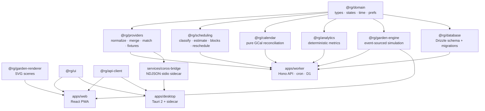

# Architecture

Run Garden is a pnpm monorepo of source-consumed TypeScript packages (internal
packages export `src/` directly; Vite/wrangler/vitest compile TS — no build
step per package). Three deployables share the packages: a Cloudflare Worker,
a React PWA, and a Tauri desktop app hosting the COROS bridge sidecar.

## Package graph



Responsibilities:

| Layer | Owns | Never does |
|---|---|---|
| `@rg/domain` | Types, the three state machines (`CorosSyncState`, `CalendarSyncState`, `CompletionState`), Luxon time math, Zod preference schemas | I/O |
| `@rg/database` | D1 schema (Drizzle) + generated SQL migrations | Business logic |
| `@rg/providers` | Raw→normalized COROS/Strava shapes, COROS⇄Strava dedup merge, planned↔completed matching, fixture provider | Network calls (callers own transport) |
| `@rg/scheduling` | Workout classification, duration-estimate chain, padded calendar blocks, reminder plans, ≤3 reschedule candidates | Changing plan contents |
| `@rg/calendar` | Pure reconciliation: desired events vs actual Google state → operations (create/update/accept user move/mark deleted/preserve notes) | Executing operations |
| `@rg/analytics` | Deterministic metrics with `MetricResult` (ok \| insufficient_data) | Guessing; LLM calls |
| `@rg/garden-engine` | `simulateDay`/`replay` over resolved day inputs, seeded PRNG (mulberry32 over FNV-1a keys) | Wall-clock, `Math.random`, DB access |
| `apps/worker` | Auth, API routes, cron sync, job queue, the single LLM call site | Holding COROS credentials |
| `services/coros-bridge` | Training Hub API client, snapshot building, the write executor | Opening HTTP ports; logging secrets |
| `apps/desktop` | Keychain, sidecar lifecycle, pairing, device signing | Talking to COROS directly (the sidecar does) |

## Data-source authority

Each fact has exactly one owner. Conflicts resolve by ownership, never by
recency guessing.

| Data | Authority | Everyone else |
|---|---|---|
| Plan existence, workout structure/targets, plan dates, **native duration estimates**, completed-run metrics (duration/distance/HR/load) and plan linkage | **COROS** | Run Garden mirrors and never edits structure; Strava metrics fill gaps only |
| Time of day, buffers, effective placement, reschedule proposals, garden state, analytics, completion resolution | **Run Garden** | COROS has no time-of-day concept; time changes on the same COROS date are local-only |
| Calendar events | **Run Garden's projection** — Google Calendar is a *view* of the intended schedule | Manual calendar edits are detected and adopted back (see [SYNC_AND_RECONCILIATION.md](SYNC_AND_RECONCILIATION.md)) |
| Activity title, route polyline, Strava metadata | **Strava** (when connected) | COROS title used only when Strava absent; merge in `packages/providers/src/merge.ts` keeps COROS authoritative for metrics |

## The three date concepts

`planned_workouts` keeps three distinct dates, never collapsed
(`packages/domain/src/workout.ts`, `packages/database/src/schema/schedule.ts`):

| Field | Meaning | Written by |
|---|---|---|
| `originalPlanDate` | Where the plan originally put the workout | Import, once; preserved across moves for "moved from" history and analytics |
| `lastVerifiedCorosDate` | Where COROS was last **verified** to have it | Only a schedule read or a verified write result — never optimism |
| `effectiveDate` + `effectiveTime` | Where Run Garden intends it; drives the calendar event | User moves, accepted upstream changes, accepted manual calendar edits |

`corosSyncState` is precisely the relationship between `effectiveDate` and
`lastVerifiedCorosDate` plus the write-job state.

## Provider capability model

`TrainingProviderCapabilities` (`packages/domain/src/capabilities.ts`) declares
what a provider can actually do: `readPlan`, `readSchedule`, `readActivities`,
`readHealth`, `readSleep`, `readNativeDurationEstimate`, `calculateWorkout`,
`updateExistingScheduledWorkout`, `addScheduledWorkout`,
`removeScheduledWorkout`, `verifyWatchSync`.

- The **bridge** reports its capability set on every sync; the worker persists
  it per device. Writes are considered possible only if a non-revoked device
  reports `updateExistingScheduledWorkout`, or both `addScheduledWorkout` and
  `removeScheduledWorkout` (`canWriteSchedule`).
- The **official COROS MCP** client (optional, worker-side) probes `tools/list`;
  when the announced official write tools ship, jobs route to the official path
  first, per the product's priority order.
- `verifyWatchSync` is **always false** today: no path can confirm the watch
  received a change, so the UI never claims it (see
  [COROS_WRITE_PROTOCOL.md](COROS_WRITE_PROTOCOL.md#watch-sync-truthfulness)).
- No capability → the workout's `corosSyncState` degrades to `calendar_only`
  and everything else still works.

## Desktop bridge ↔ cloud job queue

COROS credentials never leave the Mac (Training Hub logins from datacenter IPs
are rejected; and it is a product rule). The cloud therefore *queues* COROS
writes; the bridge *executes* them:

```mermaid
sequenceDiagram
  participant W as Web/PWA
  participant API as Worker (Cloudflare)
  participant D as Desktop app (Tauri)
  participant B as coros-bridge sidecar
  participant C as COROS Training Hub

  W->>API: POST /api/plan/workouts/:id/move
  API->>API: scheduleOverride + corosWriteJobs row (queued)<br/>state: syncing | waiting_for_device
  D->>API: POST /api/devices/bridge/jobs/claim (Ed25519-signed)
  API-->>D: job {originalDate, destinationDate, expectedContentFingerprint, workout ids}
  D->>B: executeJob (NDJSON over stdio)
  B->>C: fresh schedule read
  B->>C: status:2 direct update (raw entity/program, happenDay changed)
  B->>C: read-after-write verify
  B-->>D: outcome (verified | upstream_changed | ambiguous | …)
  D->>API: POST /api/devices/bridge/jobs/:id/result (signed)
  API->>API: job → verified/failed/needs_attention;<br/>workout.lastVerifiedCorosDate updated
  API->>API: calendar re-sync
```

Key properties (implemented in `apps/worker/src/services/jobs.ts` and
`services/coros-bridge/src/write-executor.ts`):

- **One job at a time per user**; the bridge processes requests strictly
  sequentially, so all COROS writes serialize (the `maxIdInPlan` counter is
  racy otherwise).
- Jobs are **idempotent by operation id**; claims time out after 10 minutes
  and return to the queue; newer moves supersede older pending jobs for the
  same workout; max 5 attempts, then `calendar_only`.
- A device is "online" if seen in the last 3 minutes and not paused; otherwise
  queued jobs show as **"Waiting for Mac"**.
- Every bridge request is Ed25519-signed over
  `METHOD\npath\ntimestamp\nsha256(body)`; the worker verifies with WebCrypto.
- The bridge also pushes read snapshots (plan ±[14 days back, 8 weeks ahead],
  activities, daily health) roughly every 30 minutes and polls for jobs every
  45 s (`services/coros-bridge/src/cloud-sync.ts`).

## Why Cloudflare

- **Workers + D1 + cron + static assets in one deployable**: the API, the
  scheduled sync (`*/30`, hourly at :15, Mondays 14:00 UTC), the SQLite
  database, and the built PWA ship with a single `wrangler deploy` — no
  servers, containers, or paid add-ons.
- **Free-tier fit** for a single user (see [COSTS.md](COSTS.md)); D1 is SQLite,
  which matches the local test setup (better-sqlite3) and Drizzle.
- **Always-on webhooks**: Strava's 2-second webhook budget is easy to meet from
  the edge with `waitUntil` background processing.
- The one thing Workers *cannot* do — talk to COROS from a residential IP with
  locally-held credentials — is exactly the desktop bridge's job.
